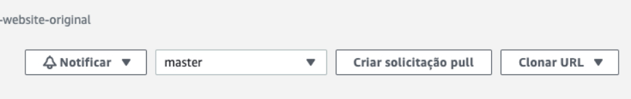
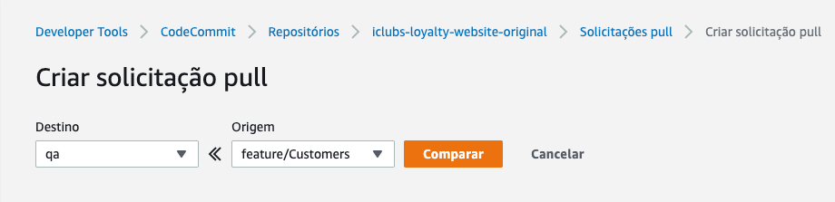
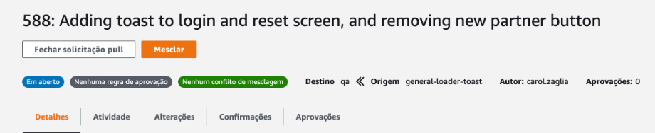
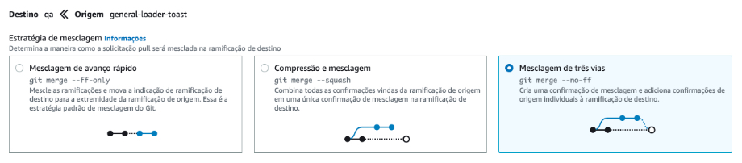

## **Pré-requisitos:**

- Node.js LTS (≥= 12.x)
- NPM (>= 6.9)
- Opcional: Yarn (>= 1.21) 


## **Repositório:**

O repositório utilizado neste projeto é o [CodeCommit](https://aws.amazon.com/pt/codecommit/) da AWS, logo, credenciais são necessárias para fazer o versionamento do código (GIT). Peça para o responsável da área fornecer suas credenciais de acesso aos respositórios.

Na situação atual, em que não temos a branch **MASTER**, o flow para criação de novas branches, solução de bugs e desenvolvimento de novas features é gerar a branch a partir de **QA**. (Para entender melhor como funciona o flow na Zappts, estudar o Z-Flow).

Para fazer as PRs (Pull Request) do código, acesse o **Console AWS do iClubs.io**, procure por **CodeCommit** na aba de pesquisa:


Em seguida, procure por "*iclubs-loyalty-website-original*" no campo de pesquisa, caso este não apareça na tela inicial:


No canto superior direito terá a opção de "*Criar solicitação de pull*", selecione a branch de destino e origem:



Compare e após a aprovação, use a opção de "merge —no ff":








## **Rodando o projeto:**

Ao ter acesso ao repositório do projeto, acesse-o no seu editor de texto de preferência (Ex: [VSCode](https://code.visualstudio.com/)) e rode o seguinte comando, para que todas as dependências do projeto sejam instaladas.:

```bash
npm install
```

:::info Alternativas
Caso prefira utilizar o Yarn basta trocar 'npm' por 'yarn'.
:::

Após instalação das depedências é necessário iniciar o projeto da seguinte forma: 

Em fase de desenvolvimento realizando teste do ambiente de desenvolimento, portanto caso queira executar seu projeto acessando as apis de DEV basta rodar o seguinte comando:

```bash
npm run start-dev
```

Após o desenvolvimento para realizar teste no ambiente de QA para garantir seu funcionamento, rode o seguinte comando:

```bash
npm run start-qa
```

Após iniciar o projeto, para visualizar basta acessar a url [https://localhost:3000](https://localhost:3000) e começar a desenvolver ;)