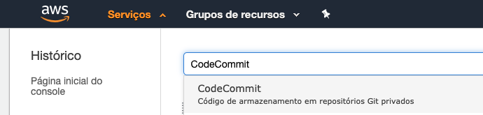
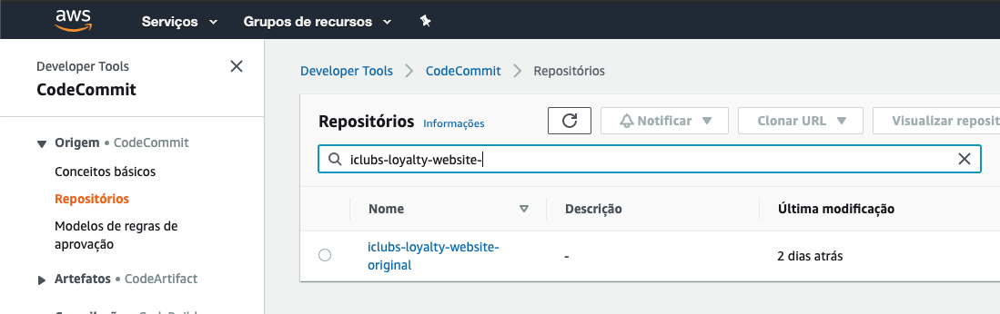
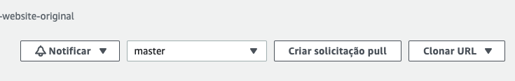
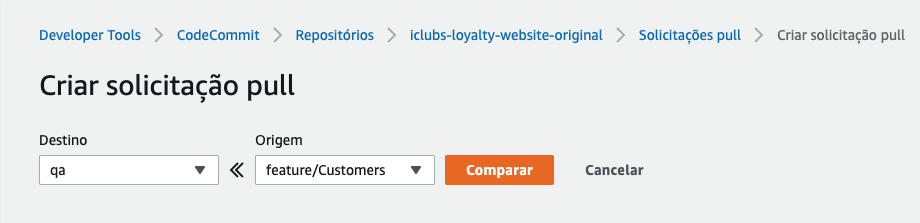

## **Ambientação com o projeto**

###  **Pré-requisitos:**

- Node.js LTS (≥= 12.x)
- NPM (>= 6.9)
- Opcional: Yarn (>= 1.21) 

Ao ter acesso ao repositório do projeto, acesse-o no seu editor de texto de preferência (Ex: [VSCode](https://code.visualstudio.com/)) e rode o comando:

```
npm install
```

Para que todas as dependências do projeto sejam instaladas.

Na situação atual, em que não temos a branch **MASTER**, o flow para criação de novas branches para solução de bugs/desenvolvimento de novas features é gerar a branch a partir de **QA**. (Para entender melhor como funciona o flow na Zappts, estudar o Z-Flow).

O repositório utilizado neste projeto é o [CodeCommit](https://aws.amazon.com/pt/codecommit/) da AWS, logo, credenciais são necessárias para fazer o versionamento do código (GIT). Peça para o responsável da área fornecer suas credenciais de acesso aos respositórios.

Para fazer as PRs (Pull Request) do código, acesse o [Console AWS do iClubs](https://us-east-2.console.aws.amazon.com/console/home?region=us-east-2#), procure por **CodeCommit** na aba de pesquisa:



Em seguida, procure por "*iclubs-loyalty-website-original*" no campo de pesquisa, caso este não apareça na tela inicial:



No canto superior direito terá a opção de "*Criar solicitação de pull*", selecione a branch de destino e origem:



Compare e após a aprovação, use a opção de "merge —no ff":

